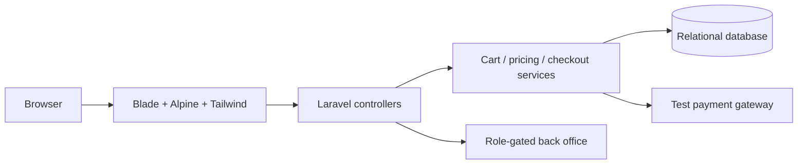

<div align="center">


**[🌐 English](README.md) · [🇮🇷 فارسی](README.fa.md)**

</div>

<div dir="rtl">

# 🛍️ SHOP 02 · LARAVEL

**ویترین فروشگاه + حساب مشتری + پنل مدیریت**

ویترین فروشگاه و دفتر مدیریت در یک برنامهٔ Laravel؛ مشتری از کشف محصول به انتخاب تنوع، علاقه‌مندی، سبد خرید و سفارش می‌رسد. در سمت مدیریت، محصول، موجودی، کوپن، سفارش، دیدگاه و تنظیمات در یک روند کاری کنار هم قرار گرفته‌اند.

| در یک نگاه | داخل پروژه |
|:---|:---|
| 🎯 تمرکز | ویترین، تجربهٔ مشتری و مدیریت |
| 🧰 Stack | PHP 8.3+ · Laravel 13 · Blade · Alpine.js · Tailwind CSS 4 · Vite 8 |
| 🌐 راهنما | [English](README.md) · [فارسی](README.fa.md) |
| 🎨 تصویر | [Animated](public/readme-assets/hero.gif) · [Static](public/readme-assets/hero.png) |

[✨ تجربهٔ خرید](#experience) · [🚀 اجرای محلی](#setup) · [🧱 معماری](#architecture) · [🌍 استقرار](#deployment)

<a id="experience"></a>

## ✨ از اولین جست‌وجو تا سفارش بعدی

| قابلیت | تجربه |
|:---|:---|
| 🔎 فهرست محصول | مرور دسته و برند، جزئیات محصول و پیشنهاد جست‌وجو. |
| 🎛️ تنوع محصول | ویژگی، مقدار ویژگی، تصویر محصول و موجودی تنوع‌ها. |
| 🛒 سبد مهمان و مشتری | تغییر سبد، کوپن، ادامهٔ خرید پس از ورود و انتقال علاقه‌مندی به سبد. |
| 🏠 حساب مشتری | پروفایل، بازیابی رمز، آدرس‌ها، سفارش‌ها و دیدگاه‌ها. |
| 🧮 محاسبه در سرور | سرویس قیمت‌گذاری و سفارش، جمع مبلغ و snapshot سفارش و آدرس را ثبت می‌کند. |
| 💳 روند پرداخت | درگاه آزمایشی، لینک امضاشدهٔ شبیه‌ساز و بررسی callback تکراری. |
| 📦 موجودی | کنترل موجودی سفارش و گردش انبار مرتبط با سفارش پرداخت‌شده. |
| 🧑‍💼 مدیریت | مسیرهای محدودشده با نقش برای محصول، دسته، برند، کوپن، بنر، سفارش و دیدگاه. |
| 🧾 گزارش و رابط | ثبت رخداد مدیریت، تنظیمات سایت، تغییر زبان انگلیسی/فارسی، sitemap و صفحه‌های سیاست‌ها. |

### 🧭 یک دور در فروشگاه

1. در `/shop` محصول را پیدا و تنوع آن را انتخاب کن.
2. به `/cart` اضافه کن، تعداد را تغییر بده و کوپن معتبر را اعمال کن.
3. وارد حساب شو، آدرس را ذخیره و در `/checkout` ادامه بده.
4. درگاه آزمایشی را کامل و سفارش را در `/account/orders` و فهرست مدیریت بررسی کن.

| مسیر | کاربرد |
|:---|:---|
| `/` | خانه و محصولات ویژه |
| `/shop` | فهرست محصولات |
| `/cart · /checkout` | سبد و سفارش |
| `/account` | حساب مشتری |
| `/admin` | مدیریت با کنترل نقش |
| `/lang/en · /lang/fa` | تغییر زبان رابط |

<a id="setup"></a>

## 🚀 اجرای محلی

PHP 8.3+، Composer، Node.js 22.12+ و پایگاه داده؛ نمونهٔ تنظیمات MySQL دارد و برای مسیر محلی ساده می‌توان SQLite را انتخاب کرد.

<div dir="ltr">

```bash
git clone https://github.com/MOHAMMADREZAABEDINPOOR/shop2.git
cd shop2

composer install
# Copy .env.example to .env.
php artisan key:generate
# Configure a database before continuing.
php artisan migrate --seed
php artisan storage:link
npm ci
npm run build
php artisan serve
```

</div>

برای SQLite، `DB_CONNECTION=sqlite` را تنظیم و خط نمونهٔ `DB_DATABASE=shop2` را حذف کن تا مسیر پیش‌فرض `database/database.sqlite` استفاده شود. فایل را با `php -r "file_exists('database/database.sqlite') || touch('database/database.sqlite');"` بساز. برای MySQL ابتدا پایگاه داده را ایجاد و اطلاعات اتصال را در `.env` تنظیم کن. مرحلهٔ seed برای پایگاه دادهٔ محلی تازه است.

آدرس **http://127.0.0.1:8000** را باز کن؛ سرور داخلی برای توسعهٔ محلی است.

### 🧪 حساب‌های نمونه

این حساب‌ها با seed محلی ساخته می‌شوند؛ فقط برای پایگاه دادهٔ تازه و نمونه‌اند. پیش از میزبانی عمومی، حساب‌ها و رمزهای نمونه را جایگزین کن.

| نقش | Email | رمز نمونه |
|:---|:---|:---|
| Super admin | `admin@digistore.ir` | `password123` |
| Staff | `staff@digistore.ir` | `password123` |
| Customer | `customer@digistore.ir` | `password123` |

## ⚙️ تنظیمات کاربردی

از [`.env.example`](.env.example) شروع کن؛ مقادیر واقعی در `.env` محلی یا محیط میزبان قرار بگیرند.

| تنظیم | کاربرد |
|:---|:---|
| `APP_KEY` | با `php artisan key:generate` ساخته می‌شود. |
| `APP_ENV / APP_DEBUG / APP_URL` | محیط، حالت توسعه و آدرس عمومی سایت. |
| `DB_CONNECTION / DB_DATABASE` | انتخاب mysql یا sqlite و پایگاه دادهٔ آن. |
| `SESSION_DRIVER / SESSION_LIFETIME` | محل ذخیره و ماندگاری نشست. |
| `SESSION_ENCRYPT` | رمزنگاری دادهٔ ذخیره‌شدهٔ نشست. |
| `MAIL_MAILER / MAIL_*` | ثبت محلی یا پیکربندی سرویس ارسال ایمیل. |
| `QUEUE_CONNECTION / CACHE_STORE` | درایور صف و کش؛ در نمونه database است. |

<a id="architecture"></a>

## 🧱 اجزای برنامه چگونه کنار هم کار می‌کنند

<div dir="ltr">



</div>

| مسیر | مسئولیت |
|:---|:---|
| [`app/Http/Controllers/Shop/`](app/Http/Controllers/Shop/) | مسیرهای فروشگاه و ثبت سفارش |
| [`app/Http/Controllers/Admin/`](app/Http/Controllers/Admin/) | روندهای مدیریت |
| [`app/Services/`](app/Services/) | منطق سبد، قیمت، سفارش، موجودی، پرداخت و ثبت رخداد |
| [`app/Models/`](app/Models/) | مدل‌های دامنه Eloquent |
| [`database/`](database/) | migration، factory و دادهٔ نمونه |
| [`resources/`](resources/) · [`routes/`](routes/) | Blade، فایل‌های رابط و مسیرهای برنامه |
| [`tests/`](tests/) | بررسی ورود، سبد، پرداخت، دسترسی و زبان |

## 💳 رفتار واقعی پرداخت

درگاه پیاده‌سازی‌شده `test_gateway` است: شبیه‌ساز تعاملی، نه اتصال به بانک واقعی. قرارداد درگاه نقطهٔ توسعه برای سرویس واقعی است؛ اتصال پروداکشن باید اعتبارسنجی سمت سرور و callback همان سرویس را پیاده‌سازی و بررسی کند.

<a id="deployment"></a>

## 🌍 از اجرای محلی تا میزبانی

document root وب‌سرور را `public/` قرار بده، فایل‌های رابط را بساز و `APP_ENV=production`، `APP_DEBUG=false` و آدرس HTTPS را تنظیم کن. `storage/` و `bootstrap/cache/` باید قابل نوشتن باشند. migration را با برنامهٔ پشتیبان و ایمیل، کش و صف را مطابق میزبان تنظیم کن. حساب‌های نمونه پیش از استفادهٔ عمومی باید جایگزین شوند.

## 🧪 بررسی‌های توسعه‌دهندگان

| دستور | هدف |
|:---|:---|
| `php artisan test --compact` | آزمون‌های رفتار برنامه |
| `npm run build` | ساخت فایل‌های Vite/Tailwind |
| `php artisan route:list` | مشاهدهٔ مسیرهای برنامه |

این‌ها دستورهای بررسی موجودند؛ فهرست آن‌ها به معنی اجرای آزمون کامل برنامه در این تغییر مستندات نیست.

## 🧩 رفع اشکال

| نشانه | راهکار |
|:---|:---|
| manifest مربوط به Vite نیست | `npm ci` و `npm run build` را اجرا کن. |
| SQLite به shop2 وصل می‌شود | مقدار نمونهٔ DB_DATABASE را حذف یا با مسیر مطلق معتبر SQLite جایگزین کن. |
| خطای 403 در /admin | با حسابی وارد شو که نقش مجاز مدیریت یا staff دارد. |

## 🧭 سه رویکرد به ساخت فروشگاه

| پروژه | رویکرد |
|:---|:---|
| [SHOP 01](https://github.com/MOHAMMADREZAABEDINPOOR/shop) | دامنه‌های Django، سفارش با کنترل موجودی و داشبورد فروش |
| [SHOP 02](https://github.com/MOHAMMADREZAABEDINPOOR/shop2) | سرویس‌های Laravel، تنوع محصول و مدیریت با نقش |
| [NEXTSHOP](https://github.com/MOHAMMADREZAABEDINPOOR/shop3) | PHP مستقیم، MVC و روتر کوچک و آماده‌سازی SQLite |

## 🤝 بازخورد و مشارکت

در issue، صفحه، رفتار مورد انتظار و مراحل بازتولید را بنویس. تغییر کد را در شاخهٔ مشخص و همراه بررسی مرتبط انجام بده.

[Issues](https://github.com/MOHAMMADREZAABEDINPOOR/shop2/issues) · [PIMX](https://github.com/MOHAMMADREZAABEDINPOOR)

## 📄 مجوز

در این نسخه فایل مجوز در سطح مخزن وجود ندارد؛ برای شرایط استفادهٔ مجدد با مالک هماهنگ کن.

---

<div align="center">

🛍️ **SHOP 02 · LARAVEL** · [English](README.md) · [فارسی](README.fa.md)

</div>

</div>
