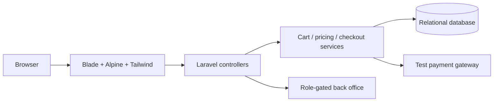

<div align="center">


**[🌐 English](README.md) · [🇮🇷 فارسی](README.fa.md)**

</div>

# 🛍️ SHOP 02 · LARAVEL

**STOREFRONT + CUSTOMER ACCOUNT + BACK OFFICE**

A complete storefront and back office in one Laravel application. Customers move from product discovery to variants, wishlists, carts and checkout; the administration area brings catalog maintenance, stock, coupons, orders, reviews and settings into one workflow.

| At a glance | What is inside |
|:---|:---|
| 🎯 Focus | Storefront, customer journey and administration |
| 🧰 Stack | PHP 8.3+ · Laravel 13 · Blade · Alpine.js · Tailwind CSS 4 · Vite 8 |
| 🌐 Documentation | [English](README.md) · [فارسی](README.fa.md) |
| 🎨 Artwork | [Animated](public/readme-assets/hero.gif) · [Static](public/readme-assets/hero.png) |

[✨ Experience](#experience) · [🚀 Run locally](#setup) · [🧱 Architecture](#architecture) · [🌍 Deployment](#deployment)

<a id="experience"></a>

## ✨ From the first search to the next order

| Capability | Experience |
|:---|:---|
| 🔎 Catalog | Category/brand browsing, product detail and search suggestions. |
| 🎛️ Product variants | Attributes, attribute values, product images and variant stock records. |
| 🛒 Guest + customer cart | Cart changes, coupons, guest sign-in continuity and wishlist-to-cart actions. |
| 🏠 Customer account | Profile, password reset, addresses, orders and reviews. |
| 🧮 Server-side totals | Pricing and checkout services calculate totals and retain order/address snapshots. |
| 💳 Payment workflow | A test gateway, signed simulator links and duplicate-callback checks. |
| 📦 Inventory | Stock-aware checkout and inventory movements linked to paid orders. |
| 🧑‍💼 Back office | Role-gated routes for products, categories, brands, coupons, banners, orders and reviews. |
| 🧾 Audit + presentation | Audit records, site settings, English/Persian locale switching, sitemap and policy pages. |

### 🧭 Take a tour

1. Browse `/shop`, open a product and choose its variant.
2. Add it to `/cart`, edit quantities and apply an available coupon.
3. Sign in, save an address and continue to `/checkout`.
4. Complete the test gateway and inspect `/account/orders` and the admin order list.

| Route | Purpose |
|:---|:---|
| `/` | Home and promoted products |
| `/shop` | Catalog |
| `/cart · /checkout` | Cart and checkout |
| `/account` | Customer account |
| `/admin` | Role-gated administration |
| `/lang/en · /lang/fa` | Interface locale switch |

<a id="setup"></a>

## 🚀 Run it locally

PHP 8.3+, Composer, Node.js 22.12+ and a database. The example configuration uses MySQL; SQLite is available for a simple local setup.

```bash
git clone https://github.com/MOHAMMADREZAABEDINPOOR/shop2.git
cd shop2

composer install
# Copy .env.example to .env.
php artisan key:generate
# Configure a database before continuing.
php artisan migrate --seed
php artisan storage:link
npm ci
npm run build
php artisan serve
```

For SQLite, set `DB_CONNECTION=sqlite` and remove the example `DB_DATABASE=shop2` line so Laravel uses `database/database.sqlite`. Create that file with `php -r "file_exists('database/database.sqlite') || touch('database/database.sqlite');"`. For MySQL, create the database first and set host, database and credentials in `.env`. The seed step is for a fresh local database.

Open **http://127.0.0.1:8000**. The built-in server is for local development.

### 🧪 Demo accounts

Created by the local seed workflow. Use them only in a fresh demonstration database; replace seeded accounts/passwords before public hosting.

| Role | Email | Demo password |
|:---|:---|:---|
| Super admin | `admin@digistore.ir` | `password123` |
| Staff | `staff@digistore.ir` | `password123` |
| Customer | `customer@digistore.ir` | `password123` |

## ⚙️ Configuration that matters

Start from [`.env.example`](.env.example); keep real values in your local `.env` or hosting environment.

| Setting | Role |
|:---|:---|
| `APP_KEY` | Generated with `php artisan key:generate`. |
| `APP_ENV / APP_DEBUG / APP_URL` | Environment, debug mode and the public base URL. |
| `DB_CONNECTION / DB_DATABASE` | Select mysql or sqlite and its database. |
| `SESSION_DRIVER / SESSION_LIFETIME` | Session storage and inactivity lifetime. |
| `SESSION_ENCRYPT` | Encryption for stored session payloads. |
| `MAIL_MAILER / MAIL_*` | Log locally or configure an email provider. |
| `QUEUE_CONNECTION / CACHE_STORE` | Queue/cache drivers; database is used in the example. |

<a id="architecture"></a>

## 🧱 How the application fits together



| Path | Responsibility |
|:---|:---|
| [`app/Http/Controllers/Shop/`](app/Http/Controllers/Shop/) | Storefront and checkout endpoints |
| [`app/Http/Controllers/Admin/`](app/Http/Controllers/Admin/) | Back-office workflows |
| [`app/Services/`](app/Services/) | Cart, pricing, checkout, inventory, payments and audit logic |
| [`app/Models/`](app/Models/) | Eloquent domain models |
| [`database/`](database/) | Migrations, factories and demo seed data |
| [`resources/`](resources/) · [`routes/`](routes/) | Blade, frontend assets and application routes |
| [`tests/`](tests/) | Authentication, cart, payment, access and locale checks |

## 💳 Payment behavior

The implemented gateway is `test_gateway`: an interactive simulator, not a live bank integration. The gateway contract is an extension point for a real provider. A production integration must implement and validate that provider’s server-side verification and callback behavior.

<a id="deployment"></a>

## 🌍 From local development to hosting

Point the web server document root to `public/`, build frontend assets, set `APP_ENV=production`, `APP_DEBUG=false` and the HTTPS base URL, and keep `storage/` and `bootstrap/cache/` writable. Run migrations with a backup plan and configure email, cache and queues for the chosen host. Demo accounts must be replaced before public use.

## 🧪 Checks for developers

| Command | Purpose |
|:---|:---|
| `php artisan test --compact` | Application feature tests |
| `npm run build` | Build Vite/Tailwind assets |
| `php artisan route:list` | Inspect the application routes |

These are available validation commands, not a claim that the full application was tested during this documentation update.

## 🧩 Troubleshooting

| Symptom | Try this |
|:---|:---|
| Vite manifest missing | Run `npm ci` and `npm run build`. |
| SQLite connection points to shop2 | Remove the sample DB_DATABASE value or replace it with a valid absolute SQLite path. |
| 403 on /admin | Sign in using a user with an allowed admin/staff role. |

## 🧭 Three approaches to commerce

| Project | Approach |
|:---|:---|
| [SHOP 01](https://github.com/MOHAMMADREZAABEDINPOOR/shop) | Django domain apps, stock-aware ordering and an operations dashboard |
| [SHOP 02](https://github.com/MOHAMMADREZAABEDINPOOR/shop2) | Laravel services, product variants and a role-gated back office |
| [NEXTSHOP](https://github.com/MOHAMMADREZAABEDINPOOR/shop3) | Direct PHP, a small MVC/router layer and SQLite bootstrap |

## 🤝 Feedback & contribution

Open an issue with the page, expected behavior and steps to reproduce. For code changes, use a focused branch and the relevant checks.

[Issues](https://github.com/MOHAMMADREZAABEDINPOOR/shop2/issues) · [PIMX](https://github.com/MOHAMMADREZAABEDINPOOR)

## 📄 License

This snapshot has no repository-level license file. Contact the owner for reuse terms.

---

<div align="center">

🛍️ **SHOP 02 · LARAVEL** · [English](README.md) · [فارسی](README.fa.md)

</div>
