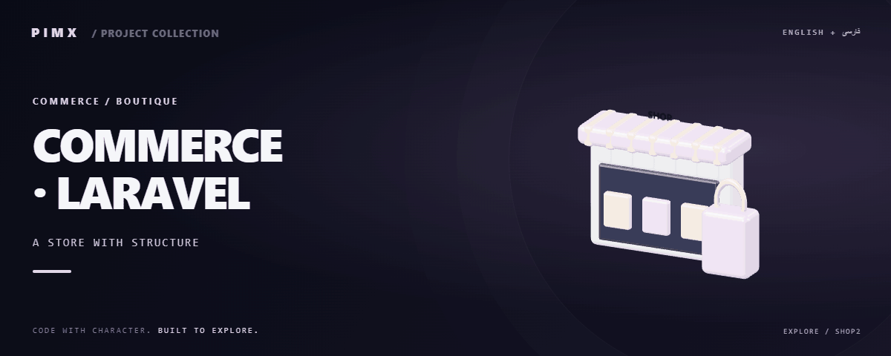

<div align="center">



**[English](README.md) · [فارسی](README.fa.md)**

</div>

# 🛍️ COMMERCE · LARAVEL

A Laravel 13 ecommerce application with an Alpine.js/Tailwind frontend, product variants, customer accounts, carts, orders and role-based administrative workflows.

[GitHub](https://github.com/MOHAMMADREZAABEDINPOOR/shop2) · [PIMX / Profile](https://github.com/MOHAMMADREZAABEDINPOOR) · [Static artwork](public/readme-assets/hero.png)

| At a glance | Details |
|:---|:---|
| 🛍️ Experience | Web application / browser experience |
| 🧰 Built with | `Vite` · `Tailwind CSS` · `php` · `laravel/framework` |
| 🌐 Documentation | [English](README.md) · [فارسی](README.fa.md) |

[✨ Features](#features) · [🚀 Getting started](#getting-started) · [⚙️ Configuration](#configuration) · [🌍 Deployment](#deployment)

---

<a id="features"></a>

## ✨ Features

| Area | Included capability |
|:---|:---|
| 🛍️ Commerce | Catalog, product variants, wishlists and reviews |
| 🛍️ Commerce | Cart, coupons, addresses and checkout |
| 👤 Accounts | Admin/staff roles with granular permissions |
| 🌐 Experience | Persian/English translations and responsive templates |

<a id="stack"></a>

## 🧰 Stack

| Tool | Version / source |
|---|---|
| Vite | `^8.0.0` |
| Tailwind CSS | `^4.0.0` |
| php | `^8.3` |
| laravel/framework | `^13.17` |

<a id="getting-started"></a>

## 🚀 Getting started

PHP 8.3+, Composer, Node.js 22.12+, npm and the database configured in .env.

```bash
git clone https://github.com/MOHAMMADREZAABEDINPOOR/shop2.git
cd shop2

composer install
# Copy .env.example to .env; configure DB_CONNECTION and credentials
php artisan key:generate
php artisan migrate --seed
# Seed only a fresh development database
npm ci
npm run build
php artisan serve
```

<a id="configuration"></a>

## ⚙️ Configuration

These names are found in the example configuration or source; not all are required. Check their defaults/usage in those files and supply secrets only in your local or hosting environment.

| Name | Role |
|---|---|
| `ANALYTICS_ID` | Application setting; inspect its definition |
| `ANALYTICS_PROVIDER` | Application setting; inspect its definition |
| `APP_DEBUG` | Application setting; inspect its definition |
| `APP_ENV` | Application setting; inspect its definition |
| `APP_FAKER_LOCALE` | Application setting; inspect its definition |
| `APP_FALLBACK_LOCALE` | Application setting; inspect its definition |
| `APP_KEY` | Credential/connection setting; keep private |
| `APP_LOCALE` | Application setting; inspect its definition |
| `APP_MAINTENANCE_DRIVER` | Application setting; inspect its definition |
| `APP_NAME` | Application setting; inspect its definition |
| `APP_URL` | Application setting; inspect its definition |
| `AUTH_PASSWORD_TIMEOUT` | Credential/connection setting; keep private |
| `AUTH_REMEMBER_DURATION` | Application setting; inspect its definition |
| `AWS_ACCESS_KEY_ID` | Credential/connection setting; keep private |
| `AWS_BUCKET` | Application setting; inspect its definition |
| `AWS_DEFAULT_REGION` | Application setting; inspect its definition |
| `AWS_SECRET_ACCESS_KEY` | Credential/connection setting; keep private |
| `AWS_USE_PATH_STYLE_ENDPOINT` | Application setting; inspect its definition |
| `BCRYPT_ROUNDS` | Application setting; inspect its definition |
| `BROADCAST_CONNECTION` | Credential/connection setting; keep private |
| `CACHE_STORE` | Application setting; inspect its definition |
| `DB_CONNECTION` | Credential/connection setting; keep private |
| `DB_DATABASE` | Application setting; inspect its definition |
| `DB_HOST` | Application setting; inspect its definition |
| `DB_PASSWORD` | Credential/connection setting; keep private |
| `DB_PORT` | Application setting; inspect its definition |
| `DB_USERNAME` | Application setting; inspect its definition |
| `FILESYSTEM_DISK` | Application setting; inspect its definition |
| `HSTS_MAX_AGE` | Application setting; inspect its definition |
| `LOG_CHANNEL` | Application setting; inspect its definition |
| `LOG_DEPRECATIONS_CHANNEL` | Application setting; inspect its definition |
| `LOG_LEVEL` | Application setting; inspect its definition |
| `LOG_STACK` | Application setting; inspect its definition |
| `MAIL_FROM_ADDRESS` | Application setting; inspect its definition |
| `MAIL_FROM_NAME` | Application setting; inspect its definition |
| `MAIL_HOST` | Application setting; inspect its definition |
| `MAIL_MAILER` | Application setting; inspect its definition |
| `MAIL_PASSWORD` | Credential/connection setting; keep private |
| `MAIL_PORT` | Application setting; inspect its definition |
| `MAIL_SCHEME` | Application setting; inspect its definition |
| `MAIL_USERNAME` | Application setting; inspect its definition |
| `MEMCACHED_HOST` | Application setting; inspect its definition |
| `QUEUE_CONNECTION` | Credential/connection setting; keep private |
| `REDIS_CLIENT` | Application setting; inspect its definition |
| `REDIS_HOST` | Application setting; inspect its definition |
| `REDIS_PASSWORD` | Credential/connection setting; keep private |
| `REDIS_PORT` | Application setting; inspect its definition |
| `SESSION_DOMAIN` | Application setting; inspect its definition |
| `SESSION_DRIVER` | Application setting; inspect its definition |
| `SESSION_ENCRYPT` | Application setting; inspect its definition |
| `SESSION_EXPIRE_ON_CLOSE` | Application setting; inspect its definition |
| `SESSION_LIFETIME` | Application setting; inspect its definition |
| `SESSION_PATH` | Application setting; inspect its definition |
| `VITE_APP_NAME` | Public browser configuration; never put secrets here |

<a id="usage"></a>

## 🎯 Usage

Use PHP 8.3+, Composer and Node compatible with Vite 8. Configure .env and a database, generate APP_KEY, migrate and seed a development database, build assets and start Artisan. Inspect routes/web.php for customer/admin paths.

<a id="project-structure"></a>

## 🗂️ Project structure

| Path | Role |
|---|---|
| [`app/`](app/) | Application routes / PHP application |
| [`database/`](database/) | Database schema/sample resources |
| [`public/`](public/) | Public web assets |
| [`resources/`](resources/) | Laravel views and frontend source |
| [`routes/`](routes/) | Laravel route definitions |
| [`tests/`](tests/) | Existing automated checks |
| [`boost.json`](boost.json) | Project entry/configuration file |
| [`composer.json`](composer.json) | Project entry/configuration file |
| [`package.json`](package.json) | Project entry/configuration file |

<a id="commands-and-checks"></a>

## 🧪 Commands and checks

| Command | Purpose |
|:---|:---|
| `npm run build` | 📦 Production build |
| `npm run dev` | 🧑‍💻 Development server |

```bash
npm run build
npm run dev
```

These commands are declared in package.json; the list is not a test execution report. Test commands may need a browser, service or prepared database.

<a id="deployment"></a>

## 🌍 Deployment

Configure production secrets, HTTPS, an independent database and allowed hosts. PHP hosting must use public/ as document root; Django needs static-file and WSGI/ASGI configuration. Development servers are for local use.

<a id="limitations"></a>

## 📌 Limitations

The seed creates demonstration users with known passwords. Replace them before hosting. Payment and mail settings need environment-specific integrations; the repository is not a guarantee of production certification.

<a id="troubleshooting"></a>

## 🛠️ Troubleshooting

- Missing packages: install dependencies using the project’s package manager.
- API/network failure: check the configured origin, provider and hosting bindings.
- Old assets: rebuild when a build script exists, then clear the browser cache.

<a id="contributing"></a>

## 🤝 Contributing

Create a focused branch, verify the affected behavior and explain the change clearly. Keep private data, build outputs and local databases out of commits.

<a id="license"></a>

## 📄 License

No repository-level license file is included in this snapshot. Public visibility alone does not grant reuse rights; contact the repository owner for terms.

---

Part of **PIMX** · Documentation in English and Persian.

---

<div align="center">

🛍️ **COMMERCE · LARAVEL** · [English](README.md) · [فارسی](README.fa.md)

</div>
